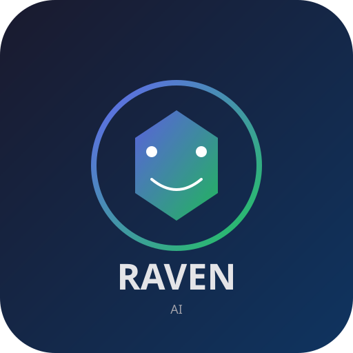

<div align="center">
  
</div>

---

## Features

| Feature | Description |
|---------|-------------|
| Language | Python 3.12+ |
| Architecture | asyncio monorepo |
| Memory | Built-in (ChromaDB) |
| Stateless mode | `raven start --stateless` |
| Web UI | Built-in (React + Alpine.js) |
| OpenRouter | Native (all models, no config) |
| Plugin System | 1 file = 1 plugin |
| IDE Integration | VS Code extension (chat, review, fix, explain) |
| Code Review | Built-in (review, suggest, find issues) |
| Git Operations | status, log, diff, commit, branch, push, pull |
| RAM Usage | ~150MB baseline |
| Multi-Agent | Per-channel configurable |
| Autonomous Mode | Full auto-pilot (cron, background tasks) |
| Voice | Roadmap |

## Quickstart

```bash
# 1. Install
pip install raven-ai

# 2. Configure
cp .env.example .env
# Edit .env with your API keys
raven onboard

# 3. Run
raven start
```

Open **http://localhost:18888** for the web UI.

### Docker

```bash
docker compose -f deploy/docker-compose.yml up
```

### From source (development)

```bash
git clone https://github.com/ssrjkk/raven.git
cd raven
pip install -e .
pip install -r requirements-dev.txt  # optional: dev dependencies
raven start
```

---

## Channels

| Channel | Status | Library |
|---------|--------|---------|
| WebChat | ✅ Built-in | FastAPI WebSocket |
| Telegram | ✅ Built-in | python-telegram-bot |
| Discord | ✅ Built-in | discord.py |
| Slack | 📦 Optional | slack-sdk |
| Matrix | 📦 Optional | matrix-nio |
| Signal | 🚧 Roadmap | signal-cli |
| iMessage | 🚧 Roadmap | pyobjc |

## Models

```
openrouter/anthropic/claude-3-opus     Best reasoning
openrouter/anthropic/claude-3-haiku    Fast & cheap
openrouter/openai/gpt-4o               GPT-4 Omni
openrouter/meta-llama/llama-3-70b      Open source
claude-3-haiku-20240307                Direct Anthropic
gpt-4o                                 Direct OpenAI
ollama/llama3                          Local (Ollama)
```

Set `DEFAULT_MODEL` in `.env` or prefix any model with `openrouter/`.

## Plugins

| Plugin | Description |
|--------|-------------|
| **memory** | ChromaDB vector store — remember, recall, forget |
| **browser** | Playwright web browsing, screenshots, DDG search |
| **cron** | APScheduler — cron-based task scheduling |
| **code** | Sandboxed Python execution, code review, explain, suggest |
| **files** | File reading and manipulation |
| **api** | HTTP requests (GET, POST, PUT, DELETE) |
| **ocr** | Tesseract OCR — text extraction from images |
| **process** | System process management (run, list, kill) |
| **git** | Git operations (status, log, diff, commit, branch, push, pull) |

### Writing a plugin

```python
# plugins/myplugin/plugin.py
PLUGIN_NAME = "myplugin"
PLUGIN_DESCRIPTION = "Does something cool"

async def my_tool(param1: str, param2: int = 42) -> str:
    """Tool description. Args: param1 (str): First param, param2 (int): Second param"""
    return f"Result: {param1} = {param2}"
```

Type hints → JSON Schema. One file = one plugin. No registration needed.

## CLI

```
raven start                    Launch the gateway
raven start --port 9090        Custom web port
raven stop                     Stop daemon
raven status                   System status
raven doctor                   Diagnostics
raven onboard                  Setup wizard
raven pairing list             Pending pairings
raven pairing approve CODE     Approve user
raven models list              Available models
raven plugins list             Loaded plugins
raven history SESSION_ID       View messages
```

## Security

- **DM Policy**: `pairing` (default), `open`, or `closed`
- **Pairing**: Users send `/pair CODE` to authorize
- **Allowlist**: Set `ALLOWED_USERS=telegram:123,discord:456`
- **Sandbox**: Code execution isolated (no network, temp dir, 30s timeout)

## Configuration

| Variable | Default | Description |
|----------|---------|-------------|
| `OPENROUTER_API_KEY` | — | OpenRouter API key |
| `ANTHROPIC_API_KEY` | — | Anthropic API key |
| `OPENAI_API_KEY` | — | OpenAI API key |
| `DEFAULT_MODEL` | `openrouter/anthropic/claude-3-haiku` | Default LLM model |
| `TELEGRAM_BOT_TOKEN` | — | Telegram bot token |
| `DISCORD_BOT_TOKEN` | — | Discord bot token |
| `DM_POLICY` | `pairing` | Access policy |
| `WEB_PORT` | `18888` | Web UI port |
| `DB_PATH` | `~/.raven/raven.db` | SQLite path |
| `VECTOR_DB_PATH` | `~/.raven/chroma` | Vector store path |

## Architecture

```
raven-ai/
├── core/              Event bus, agent loop, LLM router
│   ├── agent/         ReAct agent, multi-agent registry
│   └── gateway/       Message routing, session management
├── channels/          Messaging adapters (Telegram, Discord, WebChat)
├── plugins/           Plugin system (memory, browser, cron, code, files, api, ocr, process, git)
├── web/               TypeScript frontend (React + Vite)
├── desktop/           Electron desktop shell
├── extension/
│   ├── chrome/        Chrome browser extension (Manifest V3)
│   └── vscode/        VS Code extension (chat, review, fix, explain)
├── cli/               Command-line interface
└── deploy/            Docker, systemd, macOS launchd
```

## Tech Stack

| Layer | Technology |
|-------|-----------|
| **Backend** | Python 3.12+, FastAPI, asyncio, SQLite |
| **LLM** | OpenRouter, Anthropic, OpenAI, Ollama |
| **Memory** | ChromaDB (vector), SQLite (relational) |
| **Web** | React 19, TypeScript, Vite, Tailwind CSS v4 |
| **Desktop** | Electron 33 |
| **Browser** | Chrome Extension Manifest V3 |
| **Deploy** | Docker, systemd, launchd |

## Roadmap

**v0.2** — Voice & Mobile
- Wake word (Porcupine), TTS (ElevenLabs)
- Signal (signal-cli)
- iOS/Android push notifications

**v0.3** — Advanced
- Canvas visual workspace
- Multi-agent orchestration
- Image generation (DALL-E, SD)
- RAG over user documents

**v0.4** — Enterprise
- Kubernetes helm chart
- PostgreSQL, Redis support
- Team collaboration
- Audit logging, RBAC

## Why Raven?

1. **Python-first** — Easier AI/ML integration, larger developer ecosystem
2. **Built-in memory** — Vector DB included, not a bolt-on plugin
3. **Native OpenRouter** — All models through one API, zero config
4. **Web UI included** — Not just messenger bots
5. **Simple plugins** — One Python file = one plugin
6. **Lower cost** — ~150MB RAM vs Node.js 400MB+

## Contact

**Author:** [@ssrjkk](https://github.com/ssrjkk)

<p align="center">
  <a href="https://github.com/ssrjkk/raven"></a>
  <a href="https://github.com/ssrjkk"></a>
</p>

---

## License

MIT © 2026 [@ssrjkk](https://github.com/ssrjkk)

---

<p align="center">
  <b>🐦 Raven AI</b> — Your personal AI, always connected.
</p>
