<div align="center">
  <h1>Raven AI</h1>
  <p><i>Enterprise-grade personal AI assistant. 25+ channels. RavenFlow orchestrator. RavenCode agent. Task engine. Monitors. RAG knowledge base. Voice. Web + Desktop.</i></p>

  <a href="#features">Features</a> •
  <a href="#quickstart">Quickstart</a> •
  <a href="#cli">CLI</a> •
  <a href="#architecture">Architecture</a> •
  <a href="#tech-stack">Tech Stack</a> •
  <a href="#license">License</a>

  []()
  []()
  []()
  []()
  []()
  []()
  []()
  []()
  []()
  []()
  []()

  [English](README.md) •
  [Русский](README.ru.md) •
  [简体中文](README.zh.md) •
  [한국어](README.ko.md) •
  [Español](README.es.md) •
  [日本語](README.ja.md) •
</div>

<p align="center">
  
  
</p>

---

## Demo

<p align="center">
  <i>📺 See Raven in action (30s demo GIF — coming soon)</i>
</p>

```text
$ raven "explain this codebase and fix the failing test"
🐦 Raven is analyzing your project...
   → LSP enrichment: 3 languages detected
   → Planning debug session...
   → Running pytest — found 1 failure
   → Fixing assertion in test_users.py
   → PR opened: #42

$ raven
🐦 Interactive REPL — type your task or /help
  >
```

---

## Why Raven AI?

**Raven AI** is not just a bot. It's a full enterprise-grade automated AI assistant running 24/7 on your server.

It thinks. It plans. It acts. It speaks. It flows.

- **Communicates across 25+ channels** — Telegram, Discord, Slack, WhatsApp, Matrix, Google Chat, Signal, IRC, Teams, Feishu, LINE, web chat + 15 more
- **RavenFlow orchestrator** — multi-agent gateway daemon (port 18789) with routing engine, session management, WebSocket streaming
- **RavenCode agent** — interactive REPL coding agent (raven code) with LSP auto-enrichment, parallel multi-session, plan/safe/fast modes
- **Canvas visual workspace** — render rich components (code, tables, mermaid diagrams, images, alerts) in terminal or browser
- **Nodes distributed execution** — register, unregister, broadcast and execute across remote nodes
- **Voice I/O** — wake word detection ("Raven", "Hey Raven"), STT (Whisper/Google/Azure/Vosk), TTS (ElevenLabs/gTTS/system/Edge)
- **Executes tasks** — builds a plan from steps, executes each with a tool, returns the result
- **Runs monitors** — pings websites, checks prices, RSS, files, processes and sends alerts
- **Scheduled routines** — morning briefings, email checks, file organization
- **RAG memory** — semantic search across documents, PDF/code chunking, conversation memory
- **Web + Desktop** — React dashboard + Monaco IDE + Tauri desktop shell with bundled backend
- **Multi-user + RBAC** — admins, users, viewers with role-based access control
- **Security policies** — 5 sandbox profiles (main, non-main, code-exec, web-browsing, read-only), tool allow/deny per session

---

## Quickstart

```bash
pip install raven-agent
# Or for development: pip install -e .
cp .env.example .env
# Edit .env — add at least one LLM API key
raven onboard   # Interactive setup wizard (LLM, Telegram, channels)
raven start
```

### Ports

| Port | Service | Description |
|------|---------|-------------|
| **18888** | Web UI | Web chat, Dashboard, Monaco IDE, Settings |
| **18789** | RavenFlow Gateway | Multi-agent orchestrator daemon with WebSocket streaming |

Open in your browser:
- **http://localhost:18888** — web chat
- **http://localhost:18888/dashboard** — dashboard
- **http://localhost:18888/ide** — Monaco editor with AI sidebar

### Docker

```bash
docker compose up
```

### Web Dashboard (development)

```bash
cd web
npm install
npm run dev    # http://localhost:5173 (proxies to :18888)
```

---

## Comparison

| Feature | Raven AI | Open Interpreter | AutoGen | ChatGPT | Copilot |
|---------|----------|-----------------|---------|---------|---------|
| Self-hosted | ✅ 100% | ✅ | ❌ cloud | ❌ cloud | ❌ cloud |
| 25+ channels | ✅ | ❌ | ❌ | ✅ web only | ❌ |
| Coding agent with LSP | ✅ | ❌ | ❌ | ❌ | ✅ basic |
| Multi-agent orchestration | ✅ RavenFlow | ❌ | ✅ | ❌ | ❌ |
| Voice I/O + wake word | ✅ | ❌ | ❌ | ✅ Voice | ❌ |
| Monitors & alerts | ✅ | ❌ | ❌ | ❌ | ❌ |
| Scheduled routines | ✅ | ❌ | ❌ | ❌ | ❌ |
| RAG (local-first) | ✅ ChromaDB/Qdrant | ✅ | ❌ | ❌ | ❌ |
| RBAC multi-user | ✅ | ❌ | ❌ | ❌ | ❌ |
| 5 sandbox profiles | ✅ | ❌ | ❌ | ❌ | ❌ |
| Canvas workspace | ✅ | ❌ | ❌ | ❌ | ❌ |
| Nodes distributed exec | ✅ | ❌ | ❌ | ❌ | ❌ |
| Offline mode | ✅ `--ghost` | ✅ | ❌ | ❌ | ❌ |
| Web + Desktop app | ✅ React + Tauri | ❌ CLI only | ❌ | ✅ | ✅ IDE |
| Open source | ✅ MIT | ✅ AGPL | ✅ Apache 2 | ❌ | ❌ |
| Free | ✅ | ✅ | ✅ | ❌ $20/mo | ❌ $10/mo |

---

## Features

| Feature | Description |
|---------|-------------|
| **25+ channels** | Telegram (voice→text via Whisper, inline buttons), Discord (slash commands + embed), Slack, WhatsApp, Matrix, Google Chat, Signal, IRC, Teams, Feishu, LINE, WebChat + 15 more (Telegram API, Discord API, Slack RTM, WhatsApp Cloud, Matrix CS, Google Chat, Signal, IRC, Teams, Feishu, LINE, WebChat, Email IMAP, SMS Twilio, Alexa, Google Home, Discord Webhook, Telegram Webhook, Custom Webhook) |
| **RavenFlow Gateway** | FastAPI daemon on port 18789 with multi-agent routing engine, session management, WebSocket streaming, channel-origin dispatch, sandbox policies |
| **RavenCode Agent** | Interactive REPL coding agent (`raven code`) with prompt input, streaming responses, inline tool calls. Commands: `/multisession`, `/plan`, `/safe`, `/fast`, `/enrich`, `/exit` |
| **LSP Auto-Enrichment** | `enrich_context()` scans project, detects languages, starts LSP servers (pyright, typescript-language-server, gopls, rust-analyzer), gathers document symbols |
| **Parallel Multi-Session** | `SessionManager` with concurrent `ManagedSession` tasks, abort/cleanup, singleton pattern |
| **Canvas Visual Workspace** | Render rich components: text, code blocks, tables, mermaid diagrams, links, images, lists, alerts. Output to terminal or browser HTML |
| **Nodes Distributed Execution** | Register/unregister remote nodes, execute tasks across nodes, broadcast to all registered endpoints |
| **Voice I/O** | Wake word detection ("Raven", "Hey Raven", "OK Raven"), STT (Whisper, Google, Azure, Vosk), TTS (ElevenLabs, gTTS, system SAPI, Edge), microphone recording |
| **Sandbox Security Policy** | 5 policies (main, non-main, code-exec, web-browsing, read-only) with tool allow/deny, network controls, resource limits. Changeable at runtime |
| **Cron / Scheduling** | Schedule recurring tasks via `cron_schedule`/`cron_list`/`cron_cancel` tools (APScheduler-backed) |
| **EXE Build** | `scripts/build_exe.py` — compiles Go services, builds web frontend, packs with PyInstaller into `dist/raven-ai.exe` |
| **Unified Launcher** | `main.py` — starts NATS, Go services, RavenCode agent, RavenFlow gateway, Web UI with graceful shutdown |
| **Task Engine** | Multi-step planner — LLM breaks goals into steps, selects tools, executes, returns results |
| **Monitor Engine** | 5 monitor types: HTTP(S), asset price, RSS feed, file/directory, process. Trigger conditions, alerts, check history |
| **Routines** | Automated scheduled routines: send_briefing, check_email, organize_files, send_message |
| **RAG Knowledge Base** | Embedding engine (OpenAI + local), vector storage, document chunking (PDF/TXT/code), semantic retrieval |
| **Workspace Skills** | Skills in `workspace/skills/`: crypto, morning briefing, web search. Auto-loaded via SKILL.md |
| **Web Dashboard + IDE** | React 19 + Vite + Tailwind + Monaco Editor: Dashboard, Chat, Tasks, Monitors, Routines, Code Sessions, Settings, IDE (editor + terminal + AI sidebar) |
| **Desktop App** | Tauri desktop shell (Rust) with bundled backend service launching, Windows NSIS/MSI installer |
| **Auth & RBAC** | Multi-user authentication, 4 roles (admin/user/viewer/banned), 16 permissions, Bearer tokens |
| **Enterprise infrastructure** | Circuit breaker, HTTP pool, rate limiter, retry with exponential backoff, audit log (20 event types), Prometheus metrics, health checks |
| **Plugin system** | 10 plugins — browser, code, cron, files, git, memory, api, ocr, process, sessions. Sandbox with capability-based control |
| **Safety** | DM pairing, channel allowlist, Fernet secret encryption, rate limiting, subprocess/Docker sandbox |
| **Security Policy** | ToolPolicyEvaluator, exec.security (deny/ask/full), deny > allow priority, workspaceOnly FS, contextVisibility, sanitize_external_content, security audit CLI |

---

## CLI

```
raven start                    Start gateway
raven stop                     Stop
raven status                   System status
raven doctor                   Diagnostics
raven onboard                  Setup wizard
raven agent --message ...      Send message to agent
raven pairing list             Pairing requests
raven pairing approve CODE     Confirm user
raven models list              Available models
raven plugins list             Loaded plugins
raven history SESSION_ID       Message history
raven db migrate               DB migrations
raven db backup                DB backup
raven task list                List tasks
raven task run <goal>          Run task
raven task show <id>           Task details
raven task cancel <id>         Cancel task
raven monitor list             List monitors
raven monitor add ...          Add monitor
raven code                     Interactive coding REPL
raven code --project <dir>     Start REPL in project directory
raven code --plan              Plan-only mode (no writes)
raven code --safe              Safe mode (confirmations on writes)
raven code --parallel          Enable parallel multi-session
raven code index <path>        Index code
raven code search <query>      Search code
raven code review <file>       Review file
raven routine list             List routines
raven routine add ...          Add routine
raven security audit           Security check
raven security audit --deep    Deep check (network, env, dependencies)
raven security audit --fix     Auto-fix issues
raven flow serve --port 18789  Start RavenFlow gateway daemon
raven flow ask <message>       Send message to running gateway
raven flow sessions            List active Flow sessions
```

## Chat Commands

```
/status               Bot status
/new                  New conversation
/reset                Reset session
/compact              Compress history
/task <goal>          Execute task
/monitor list         List monitors
/monitor add <type> <target>  Add monitor
/code index [path]    Index code
/code search <query>  Search code
/code review <file>   Review file
/routine list         List routines
/routine add <action> <sched>  Add routine
/help                 All commands
/pair <code>         Pair user
```

---

## Architecture

```mermaid
flowchart TB
    subgraph Clients["Clients & Channels"]
        TG[Telegram]
        DC[Discord]
        SL[Slack]
        WA[WhatsApp]
        WB[Web Dashboard\nReact 19 + Vite]
        CLI[CLI / TUI]
    end

    subgraph Gateway["API Gateway Layer"]
        GW["Gateway (Go)\n:8000"]
        CB["Circuit Breaker"]
        RL["Rate Limiter"]
        AUTH["Auth Middleware\nJWT Validation"]
    end

    subgraph Services["Microservices"]
        AS["Auth Service (Go)\n:8001 — JWT, SQLite, gRPC"]
        AC["Agent Core (Python)\n:8002 — LLM Router"]
        ME["Monitor Engine (Go)\n:8003 — SQLite, NATS"]
        RS["RAG Service (Python)\n:8004 — Qdrant"]
        TE["Task Engine (Python)\n:8005 — SQLite, Outbox, Saga"]
        CS["Code Service (Python)\n:8006 — Sandbox"]
    end

    subgraph Observability["Observability Stack"]
        OTEL["OTel Collector\n:4317 gRPC / :4318 HTTP"]
        TEMPO["Tempo\nTrace Storage"]
        LOKI["Loki\nLog Aggregation"]
        PROM["Prometheus\n:9090"]
        GRAF["Grafana\n:3000 — Dashboards"]
    end

    subgraph Messaging["Message Broker"]
        NATS["NATS / JetStream\n:4222"]
    end

    subgraph Storage["Data Layer"]
        SQLITE["SQLite\nAuth / Monitor / Task DBs"]
        QDRANT["Qdrant\nVector Store :6333"]
        FS[(File System\nWorkspace / Data)]
    end

    subgraph LLM["LLM Providers"]
        OLLAMA["Ollama (Local)"]
        OR["OpenRouter"]
        ANTH["Anthropic"]
        OPENAI["OpenAI"]
    end

    subgraph AgentSystem["Agent System"]
        AGENT["ReAct Agent\nFSM States"]
        TOOLS["Tool Registry\nPlugin System"]
        MEM["Memory / Context"]
    end

    TG --> GW
    DC --> GW
    SL --> GW
    WA --> GW
    WB --> GW
    CLI --> GW

    GW --> CB
    CB --> RL
    RL --> AUTH

    AUTH --> AS
    GW --> AC
    GW --> ME
    GW --> RS
    GW --> TE
    GW --> CS

    AC --> LLM
    AC --> AGENT
    AGENT --> TOOLS
    AGENT --> MEM

    OLLAMA -.-> OR
    OR -.-> ANTH
    ANTH -.-> OPENAI

    AC -.->|agent.response| NATS
    ME -.->|monitor.check.completed| NATS
    TE -.->|task.events| NATS
    AS -.->|auth.user.created| NATS

    GW -->|traces/metrics| OTEL
    AS -->|traces/metrics| OTEL
    AC -->|traces/metrics| OTEL
    ME -->|traces/metrics| OTEL
    RS -->|traces/metrics| OTEL
    TE -->|traces/metrics| OTEL
    CS -->|traces/metrics| OTEL
    WB -->|traces| OTEL

    OTEL --> TEMPO
    OTEL --> LOKI
    PROM --> GW
    PROM --> AS
    PROM --> ME
    PROM --> OTEL
    GRAF --> PROM
    GRAF --> TEMPO
    GRAF --> LOKI

    AS --> SQLITE
    ME --> SQLITE
    TE --> SQLITE
    RS --> QDRANT
    CS --> FS
    AGENT --> FS

    style Clients fill:#1a1a2e,stroke:#16213e
    style Gateway fill:#0f3460,stroke:#1a1a2e
    style Services fill:#16213e,stroke:#0f3460
    style Observability fill:#1a1a3e,stroke:#2a2a5e
    style Messaging fill:#2d1b69,stroke:#1a1a2e
    style Storage fill:#1a3a2e,stroke:#16213e
    style LLM fill:#3a1a1a,stroke:#2a0a0a
    style AgentSystem fill:#1a2a3a,stroke:#0f3460
```



## Project Tree

```
raven/
├── raven/                      # Main Python package
│   ├── agent/                  ReAct agent, multi-agent registry, workspace prompts
│   ├── gateway/                Message routing, RavenFlow daemon, routing engine
│   ├── core/
│   │   ├── auth/               Authentication, RBAC (4 roles, 16 permissions), API tokens
│   │   ├── security/           ToolPolicyEvaluator, SandboxPolicy, SecurityAudit, PII redaction
│   │   ├── task_engine/        Planner, executor, task storage
│   │   ├── monitor/            HTTP, price, RSS, file, process monitors + conditions
│   │   ├── rag/                Embedding engine, chunking, vector store
│   │   ├── llm.py              LLM providers (OpenAI, Anthropic, Ollama, OpenRouter) + failover
│   │   ├── config.py           Pydantic Settings + YAML config
│   │   └── admin_api.py        Admin REST API
│   ├── channels/               25+ channels, registry, message bus, CircuitBreakerChannel
│   ├── cli/                    CLI (click + rich) — raven code, raven flow
│   ├── tools/                  Canvas, Nodes, Plugin tools
│   ├── tui/                    Terminal UI (textual)
│   ├── voice/                  Wake word detection, STT, TTS modules
│   └── workspace/              Workspace manager, skills, plugin loader
├── ravencode/                  # RavenCode agent framework
│   ├── runtime/
│   │   ├── lsp.py              LSP auto-enrichment (pyright, tsserver, gopls, rust-analyzer)
│   │   ├── multisession.py     Parallel multi-session manager
│   │   └── tools.py            Tool registry (read, write, edit, bash, canvas, nodes, cron, sandbox, talk)
│   └── cli/coding.py           Interactive REPL coding agent
├── services/                   # Microservices (Go + Python)
│   ├── gateway/                Go gateway (auth proxy, circuit breaker, rate limiter, metrics, gRPC)
│   ├── auth/                   Go auth service (SQLite, JWT, gRPC, Redis rate limiter)
│   ├── agent-core/             Python — LLM router (Ollama/OpenAI/Anthropic), NATS pub/sub
│   ├── monitor-engine/         Go monitor service (SQLite, NATS, Prometheus)
│   ├── rag-service/            Python — semantic search (Qdrant + in-memory fallback)
│   ├── task-engine/            Python — task planner (SQLite, NATS, idempotency, outbox, saga)
│   ├── code-service/           Python — code sandbox + RavenCode agent API + AST context
│   └── proto/                  Protobuf definitions + generated Go code
├── web/                        React 19 + Vite + Tailwind dashboard + Monaco IDE
├── desktop-tauri/              Tauri desktop shell (Rust) with backend launcher
├── deploy/                     Docker, k8s, systemd, Observability stack
├── daemon/                     Rust daemon (ravend): system metrics, process management
├── scripts/                    Build scripts, EXE builder
├── aios/                       AI-OS-MVP agent framework
└── plugins/                    User plugins
```

## Tech Stack

| Layer | Technology |
|-------|-----------|
| **Backend** | Python 3.13+, FastAPI, asyncio, SQLite (modernc.org/sqlite) |
| **LLM** | Ollama (local) → OpenRouter → Anthropic → OpenAI (failover) |
| **Memory** | SQLite + ChromaDB + numpy vector store |
| **RAG** | Qdrant vector store, fallback in-memory, n-gram embedding |
| **Auth** | bcrypt, JWT (HS256), gRPC, RBAC (4 roles, 16 permissions) |
| **Frontend** | React 19, Vite 6, Tailwind CSS 4, react-router-dom, Monaco Editor |
| **Channels** | python-telegram-bot, discord.py, slack-sdk, matrix-nio, IRC asyncio, 25+ registry |
| **RavenFlow** | FastAPI daemon (port 18789), routing engine, WebSocket streaming, multi-agent dispatch |
| **RavenCode** | Interactive REPL, LSP auto-enrichment (pyright/tsserver/gopls/rust-analyzer), parallel multi-session, plan/safe/fast modes, 30+ tools |
| **Canvas** | Rich component rendering (code, table, mermaid, image, link, list, alert), HTML + browser output |
| **Nodes** | Distributed node registry, broadcast execution, async HTTP dispatch |
| **Voice** | WakeWordDetector (speech_recognition), Whisper/Google/Azure/Vosk STT, ElevenLabs/gTTS/SAPI/Edge TTS |
| **Sandbox Policy** | 5 policy profiles (main/non-main/code-exec/web-browsing/read-only), runtime tool allow/deny |
| **Message Broker** | NATS + JetStream (streams: agent.response, monitor.check.completed, task.events, auth.user.created) |
| **Gateway** | Go 1.26 — circuit breaker, rate limiter, auth proxy, gRPC retry, OpenTelemetry |
| **Auth Service** | Go 1.26 — SQLite, JWT, gRPC, token bucket rate limiter, OpenTelemetry |
| **Monitor Engine** | Go 1.26 — HTTP health checks, SQLite, NATS events, Prometheus metrics |
| **Resilience** | Circuit breaker, gRPC retry (exponential backoff), rate limiter, outbox pattern, saga pattern, idempotency |
| **Observability** | OpenTelemetry (traces + metrics), Prometheus, Grafana (12 panels), Loki, Tempo, health/ready probes |
| **Security** | Rate limiting, JWT auth, DM pairing, Fernet encryption, RBAC, plugin sandbox, ToolPolicyEvaluator (deny/allow), exec security policy (deny/ask/full), contextVisibility, workspace isolation, security audit CLI |
| **CI/CD** | GitHub Actions — parallel Go/Python/web lint + test + build, Allure TestOps, Docker buildx, Codecov, Playwright E2E, k6 load tests |
| **Deploy** | Docker (multi-stage, distroless, non-root), docker-compose (microservice stack), Kubernetes manifests, systemd, launchd |
| **Testing** | pytest (800+ tests, Allure reporting), Go table-driven tests, Vitest (React), Playwright (E2E), k6 (load) |

---

## RavenCode — Terminal Coding Agent

Raven AI includes `raven code`, a full-featured interactive terminal coding agent:

```bash
# Start the REPL
raven code --project ./my-project

# In the REPL:
raven@project> create a REST API with FastAPI
# ... streams response, makes tool calls, edits files inline

# Built-in commands:
/help          Show available commands
/multisession  Run subtasks in parallel
/plan          Toggle plan-only mode (no writes)
/safe          Toggle safe mode (confirm before writes)
/fast          Toggle fast mode (skip enrichment)
/enrich        Refresh LSP analysis
/session <id>  Switch to a parallel session
/exit          Exit
```

### RavenFlow Gateway

Multi-agent orchestrator daemon with WebSocket streaming:

```bash
# Start the gateway
raven flow serve --port 18789

# Send an agent message
raven flow ask "summarize the README"

# List active sessions
raven flow sessions
```

### Canvas Visual Workspace

Render rich visual components directly from the agent:

```python
await canvas_render([
    {"type": "code", "language": "typescript", "content": "const x = 1"},
    {"type": "table", "headers": ["Name", "Value"], "rows": [["a", "1"]]},
    {"type": "mermaid", "content": "graph TD; A-->B"},
])
```

### Unified Desktop App

A single `main.py` launcher runs all services:
```bash
python main.py --web-port 5173 --flow-port 18789
```

Build everything into one EXE:
```bash
python scripts/build_exe.py
# Output: dist/raven-ai.exe
```

---

## Contact

<div align="center">
  <p>
    <b>Raven AI</b> — developed by <a href="https://github.com/ssrjkk">@ssrjkk</a>
  </p>
  <p>
    <a href="https://github.com/ssrjkk/raven">GitHub</a> •
    <a href="https://t.me/ssrjkk">Telegram</a> •
    <a href="mailto:ray013lefe@gmail.com">ray013lefe@gmail.com</a> •
    <a href="https://t.me/ssrjkk">@ssrjkk</a>
  </p>
  <p>
    Have an idea or bug? → <a href="https://github.com/ssrjkk/raven/issues">Open an issue</a>
  </p>
  <p>
    Want to contribute? → <a href="https://github.com/ssrjkk/raven/pulls">Pull Request</a>
  </p>
  <p><i>Built for developers who need their personal AI 24/7</i></p>
</div>

## License

MIT © 2026 [@ssrjkk](https://github.com/ssrjkk)
