<div align="center">
  <h1>Raven AI</h1>
  <p><i>Enterprise-grade personal AI assistant. 12 channels. Task engine. Monitors. Coding assistant. RAG knowledge base. Web dashboard.</i></p>

  <a href="#features">Features</a> •
  <a href="#quickstart">Quickstart</a> •
  <a href="#cli">CLI</a> •
  <a href="#architecture">Architecture</a> •
  <a href="#tech-stack">Tech Stack</a> •
  <a href="#license">License</a>

  []()
  []()
  []()
  []()
  []()
  []()
  []()
  []()
  []()

  [English](README.md) •
  [Русский](README.ru.md) •
  [简体中文](README.zh.md) •
  [繁體中文](README.zht.md) •
  [한국어](README.ko.md) •
  [Deutsch](README.de.md) •
  [Español](README.es.md) •
  [Français](README.fr.md) •
  [Italiano](README.it.md) •
  [Dansk](README.da.md) •
  [日本語](README.ja.md) •
  [Polski](README.pl.md) •
  [العربية](README.ar.md) •
  [Bosanski](README.bs.md) •
  [Norsk](README.no.md) •
  [Português (Brasil)](README.br.md) •
  [ไทย](README.th.md) •
  [Türkçe](README.tr.md) •
  [Українська](README.uk.md) •
  [বাংলা](README.bn.md) •
  [Ελληνικά](README.gr.md) •
  [Tiếng Việt](README.vi.md)
</div>

---

## Why Raven AI?

**Raven AI** is not just a bot. It's a full enterprise-grade automated AI assistant running 24/7 on your server.

It thinks. It plans. It acts.

- **Communicates across 12 messengers** — Telegram, Discord, Slack, WhatsApp, Matrix, Google Chat, Signal, IRC, Teams, Feishu, LINE + web chat
- **Executes tasks** — builds a plan from steps, executes each with a tool, returns the result
- **Runs monitors** — pings websites, checks prices, RSS, files, processes and sends alerts
- **Writes code** — indexes codebase, searches symbols, reviews files, manages development sessions
- **Scheduled routines** — morning briefings, email checks, file organization
- **RAG memory** — semantic search across documents, PDF/code chunking, conversation memory
- **Web dashboard** — React panel with monitoring, task management, monitors and routines
- **Multi-user + RBAC** — admins, users, viewers with role-based access control

---

## Quickstart

```bash
pip install raven-agent
# Or for development: pip install -e .
cp .env.example .env
# Edit .env — add at least one LLM API key
raven onboard   # Interactive setup wizard (LLM, Telegram, channels)
raven start
```

Open in your browser:
- **http://localhost:18888** — web chat
- **http://localhost:18888/dashboard** — dashboard

### Docker

```bash
docker compose up
```

### Web Dashboard (development)

```bash
cd web
npm install
npm run dev    # http://localhost:5173 (proxies to :18888)
```

---

## Features

| Feature | Description |
|---------|-------------|
| **12 channels** | Telegram (voice→text via Whisper, inline buttons), Discord (slash commands + embed), Slack, WhatsApp, Matrix, Google Chat, Signal, IRC, Teams, Feishu, LINE, WebChat |
| **Task Engine** | Multi-step planner — LLM breaks goals into steps, selects tools, executes, returns results |
| **Monitor Engine** | 5 monitor types: HTTP(S), asset price, RSS feed, file/directory, process. Trigger conditions, alerts, check history |
| **Coding Assistant** | Code indexing (AST parsing, 8 languages), semantic search, file review (LLM-driven), development sessions |
| **Routines** | Automated scheduled routines: send_briefing, check_email, organize_files, send_message |
| **RAG Knowledge Base** | Embedding engine (OpenAI + local), vector storage, document chunking (PDF/TXT/code), semantic retrieval |
| **Workspace Skills** | Skills in `workspace/skills/`: crypto, morning briefing, web search. Auto-loaded via SKILL.md |
| **Web Dashboard** | React 19 + Vite + Tailwind: Dashboard, Chat, Tasks, Monitors, Routines, Code Sessions, Settings |
| **Auth & RBAC** | Multi-user authentication, 4 roles (admin/user/viewer/banned), 16 permissions, Bearer tokens |
| **Enterprise infrastructure** | Circuit breaker, HTTP pool, rate limiter, retry with exponential backoff, audit log (20 event types), Prometheus metrics, health checks |
| **Plugin system** | 10 plugins — browser, code, cron, files, git, memory, api, ocr, process, sessions. Sandbox with capability-based control |
| **Safety** | DM pairing, channel allowlist, Fernet secret encryption, rate limiting, subprocess/Docker sandbox |
| **Security Policy** | ToolPolicyEvaluator, exec.security (deny/ask/full), deny > allow priority, workspaceOnly FS, contextVisibility, sanitize_external_content, security audit CLI |

---

## CLI

```
raven start                    Start gateway
raven stop                     Stop
raven status                   System status
raven doctor                   Diagnostics
raven onboard                  Setup wizard
raven agent --message ...      Send message to agent
raven pairing list             Pairing requests
raven pairing approve CODE     Confirm user
raven models list              Available models
raven plugins list             Loaded plugins
raven history SESSION_ID       Message history
raven db migrate               DB migrations
raven db backup                DB backup
raven task list                List tasks
raven task run <goal>          Run task
raven task show <id>           Task details
raven task cancel <id>         Cancel task
raven monitor list             List monitors
raven monitor add ...          Add monitor
raven code index <path>        Index code
raven code search <query>      Search code
raven code review <file>       Review file
raven routine list             List routines
raven routine add ...          Add routine
raven security audit           Security check
raven security audit --deep    Deep check (network, env, dependencies)
raven security audit --fix     Auto-fix issues
```

## Chat Commands

```
/status               Bot status
/new                  New conversation
/reset                Reset session
/compact              Compress history
/task <goal>          Execute task
/monitor list         List monitors
/monitor add <type> <target>  Add monitor
/code index [path]    Index code
/code search <query>  Search code
/code review <file>   Review file
/routine list         List routines
/routine add <action> <sched>  Add routine
/help                 All commands
/pair <code>         Pair user
```

---

## Architecture

```mermaid
flowchart TB
    subgraph Clients["Clients & Channels"]
        TG[Telegram]
        DC[Discord]
        SL[Slack]
        WA[WhatsApp]
        WB[Web Dashboard\nReact 19 + Vite]
        CLI[CLI / TUI]
    end

    subgraph Gateway["API Gateway Layer"]
        GW["Gateway (Go)\n:8000"]
        CB["Circuit Breaker"]
        RL["Rate Limiter"]
        AUTH["Auth Middleware\nJWT Validation"]
    end

    subgraph Services["Microservices"]
        AS["Auth Service (Go)\n:8001 — JWT, SQLite, gRPC"]
        AC["Agent Core (Python)\n:8002 — LLM Router"]
        ME["Monitor Engine (Go)\n:8003 — SQLite, NATS"]
        RS["RAG Service (Python)\n:8004 — Qdrant"]
        TE["Task Engine (Python)\n:8005 — SQLite, Outbox, Saga"]
        CS["Code Service (Python)\n:8006 — Sandbox"]
    end

    subgraph Observability["Observability Stack"]
        OTEL["OTel Collector\n:4317 gRPC / :4318 HTTP"]
        TEMPO["Tempo\nTrace Storage"]
        LOKI["Loki\nLog Aggregation"]
        PROM["Prometheus\n:9090"]
        GRAF["Grafana\n:3000 — Dashboards"]
    end

    subgraph Messaging["Message Broker"]
        NATS["NATS / JetStream\n:4222"]
    end

    subgraph Storage["Data Layer"]
        SQLITE["SQLite\nAuth / Monitor / Task DBs"]
        QDRANT["Qdrant\nVector Store :6333"]
        FS[(File System\nWorkspace / Data)]
    end

    subgraph LLM["LLM Providers"]
        OLLAMA["Ollama (Local)"]
        OR["OpenRouter"]
        ANTH["Anthropic"]
        OPENAI["OpenAI"]
    end

    subgraph AgentSystem["Agent System"]
        AGENT["ReAct Agent\nFSM States"]
        TOOLS["Tool Registry\nPlugin System"]
        MEM["Memory / Context"]
    end

    TG --> GW
    DC --> GW
    SL --> GW
    WA --> GW
    WB --> GW
    CLI --> GW

    GW --> CB
    CB --> RL
    RL --> AUTH

    AUTH --> AS
    GW --> AC
    GW --> ME
    GW --> RS
    GW --> TE
    GW --> CS

    AC --> LLM
    AC --> AGENT
    AGENT --> TOOLS
    AGENT --> MEM

    OLLAMA -.-> OR
    OR -.-> ANTH
    ANTH -.-> OPENAI

    AC -.->|agent.response| NATS
    ME -.->|monitor.check.completed| NATS
    TE -.->|task.events| NATS
    AS -.->|auth.user.created| NATS

    GW -->|traces/metrics| OTEL
    AS -->|traces/metrics| OTEL
    AC -->|traces/metrics| OTEL
    ME -->|traces/metrics| OTEL
    RS -->|traces/metrics| OTEL
    TE -->|traces/metrics| OTEL
    CS -->|traces/metrics| OTEL
    WB -->|traces| OTEL

    OTEL --> TEMPO
    OTEL --> LOKI
    PROM --> GW
    PROM --> AS
    PROM --> ME
    PROM --> OTEL
    GRAF --> PROM
    GRAF --> TEMPO
    GRAF --> LOKI

    AS --> SQLITE
    ME --> SQLITE
    TE --> SQLITE
    RS --> QDRANT
    CS --> FS
    AGENT --> FS

    style Clients fill:#1a1a2e,stroke:#16213e
    style Gateway fill:#0f3460,stroke:#1a1a2e
    style Services fill:#16213e,stroke:#0f3460
    style Observability fill:#1a1a3e,stroke:#2a2a5e
    style Messaging fill:#2d1b69,stroke:#1a1a2e
    style Storage fill:#1a3a2e,stroke:#16213e
    style LLM fill:#3a1a1a,stroke:#2a0a0a
    style AgentSystem fill:#1a2a3a,stroke:#0f3460
```



## Project Tree

```
raven/
├── raven/                      # Main Python package
│   ├── agent/                  ReAct agent, multi-agent registry, workspace prompts
│   ├── gateway/                Message routing, sessions, commands
│   ├── core/
│   │   ├── auth/               Authentication, RBAC (4 roles, 16 permissions), API tokens
│   │   ├── security/           ToolPolicyEvaluator, PII redaction, SecurityAudit
│   │   ├── task_engine/        Planner, executor, task storage
│   │   ├── monitor/            HTTP, price, RSS, file, process monitors + conditions
│   │   ├── rag/                Embedding engine, chunking, vector store
│   │   ├── llm.py              LLM providers (OpenAI, Anthropic, Ollama, OpenRouter) + failover
│   │   ├── config.py           Pydantic Settings + YAML config
│   │   └── admin_api.py        Admin REST API
│   ├── channels/               12 channels, message bus, CircuitBreakerChannel
│   ├── cli/                    CLI (click + rich)
│   ├── tools/                  Plugin tools
│   ├── tui/                    Terminal UI (textual)
│   └── workspace/              Workspace manager, skills, plugin loader
├── services/                   # Microservices (Go + Python)
│   ├── gateway/                Go gateway (auth proxy, circuit breaker, rate limiter, metrics, gRPC)
│   ├── auth/                   Go auth service (SQLite, JWT, gRPC, Redis rate limiter)
│   ├── agent-core/             Python — LLM router (Ollama/OpenAI/Anthropic), NATS pub/sub
│   ├── monitor-engine/         Go monitor service (SQLite, NATS, Prometheus)
│   ├── rag-service/            Python — semantic search (Qdrant + in-memory fallback)
│   ├── task-engine/            Python — task planner (SQLite, NATS, idempotency, outbox, saga)
│   ├── code-service/           Python — code sandbox (subprocess, NATS)
│   └── proto/                  Protobuf definitions + generated Go code
├── web/                        React 19 + Vite + Tailwind dashboard
├── deploy/                     Docker, k8s, systemd, Observability stack
├── daemon/                     Rust daemon (ravend): system metrics, process management
├── aios/                       AI-OS-MVP agent framework
└── plugins/                    User plugins
```

## Tech Stack

| Layer | Technology |
|-------|-----------|
| **Backend** | Python 3.13+, FastAPI, asyncio, SQLite (modernc.org/sqlite) |
| **LLM** | Ollama (local) → OpenRouter → Anthropic → OpenAI (failover) |
| **Memory** | SQLite + ChromaDB + numpy vector store |
| **RAG** | Qdrant vector store, fallback in-memory, n-gram embedding |
| **Auth** | bcrypt, JWT (HS256), gRPC, RBAC (4 roles, 16 permissions) |
| **Frontend** | React 19, Vite 6, Tailwind CSS 4, react-router-dom, Monaco Editor |
| **Channels** | python-telegram-bot, discord.py, slack-sdk, matrix-nio, IRC asyncio |
| **Message Broker** | NATS + JetStream (streams: agent.response, monitor.check.completed, task.events, auth.user.created) |
| **Gateway** | Go 1.26 — circuit breaker, rate limiter, auth proxy, gRPC retry, OpenTelemetry |
| **Auth Service** | Go 1.26 — SQLite, JWT, gRPC, token bucket rate limiter, OpenTelemetry |
| **Monitor Engine** | Go 1.26 — HTTP health checks, SQLite, NATS events, Prometheus metrics |
| **Resilience** | Circuit breaker, gRPC retry (exponential backoff), rate limiter, outbox pattern, saga pattern, idempotency |
| **Observability** | OpenTelemetry (traces + metrics), Prometheus, Grafana (12 panels), Loki, Tempo, health/ready probes |
| **Security** | Rate limiting, JWT auth, DM pairing, Fernet encryption, RBAC, plugin sandbox, ToolPolicyEvaluator (deny/allow), exec security policy (deny/ask/full), contextVisibility, workspace isolation, security audit CLI |
| **CI/CD** | GitHub Actions — parallel Go/Python/web lint + test + build, Allure TestOps, Docker buildx, Codecov, Playwright E2E, k6 load tests |
| **Deploy** | Docker (multi-stage, distroless, non-root), docker-compose (microservice stack), Kubernetes manifests, systemd, launchd |
| **Testing** | pytest (800+ tests, Allure reporting), Go table-driven tests, Vitest (React), Playwright (E2E), k6 (load) |

---

## AI-OS-MVP — Hybrid Architecture

Raven AI now runs in a hybrid **AI-OS-MVP** architecture:

```
raven-ai/
├── aios/                       # AI-OS-MVP bridge (Python)
│   ├── api/bridge.py           # AI Gateway endpoint
│   ├── agents/orchestrator.py  # Agent orchestrator
│   └── runtime/adapter.py      # Unified runtime
├── web/                        # Web IDE (React 19)
│   └── src/pages/IDE.tsx       # IDE with editor + terminal
├── desktop-tauri/              # Tauri desktop (Rust)
├── packages/                   # TypeScript packages
│   ├── ai-core/                # AI router + providers
│   ├── agents/                 # Multi-agent system
│   ├── runtime/                # Terminal, fs, docker
│   └── repo/                   # Indexer, AST, embeddings
```

### AI-OS-MVP Quickstart

```bash
# AI Gateway (bridge over Raven)
raven aios gateway --port 3001

# Run autonomous agent
raven aios run "create a REST API" --agent autonomous

# Execute a command
raven aios exec "npm run dev"

# Web IDE (Monaco editor)
cd web && npm install && npm run dev
# Open http://localhost:5173/ide
```

---

## Contact

<div align="center">
  <p>
    <b>Raven AI</b> — developed by <a href="https://github.com/ssrjkk">@ssrjkk</a>
  </p>
  <p>
    <a href="https://github.com/ssrjkk/raven">GitHub</a> •
    <a href="https://t.me/ssrjkk">Telegram</a> •
    <a href="mailto:ray013lefe@gmail.com">ray013lefe@gmail.com</a> •
    <a href="https://t.me/ssrjkk">@ssrjkk</a>
  </p>
  <p>
    Have an idea or bug? → <a href="https://github.com/ssrjkk/raven/issues">Open an issue</a>
  </p>
  <p>
    Want to contribute? → <a href="https://github.com/ssrjkk/raven/pulls">Pull Request</a>
  </p>
  <p><i>Built for developers who need their personal AI 24/7</i></p>
</div>

## License

MIT © 2026 [@ssrjkk](https://github.com/ssrjkk)
